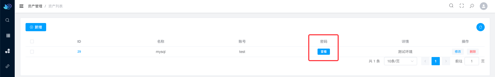
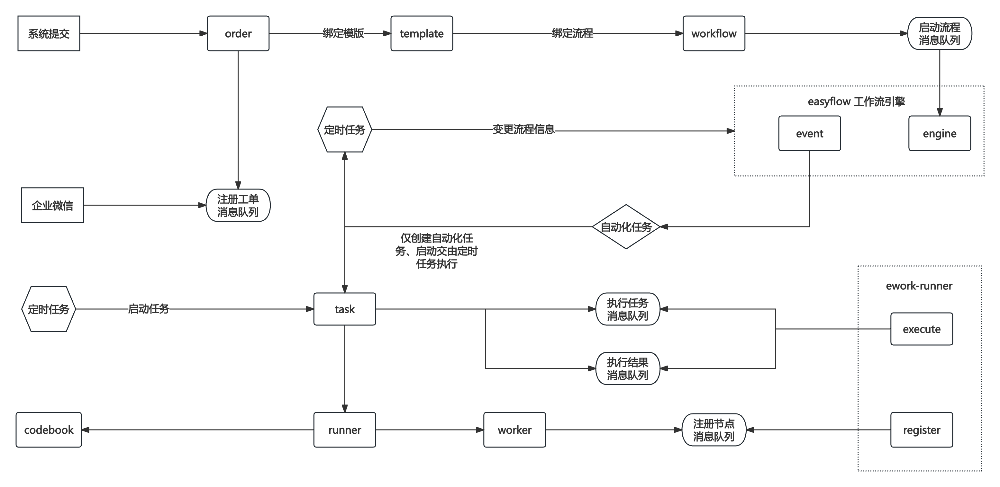

# ecmdb
## 前言
这个系统最初设计是为了业余学习以及结合工作需求开发的，目标是创建一个CMDB资产管理系统。完成初步开发后，
发现仅仅记录资产信息并不能完全体现平台的价值，且不支持自动化录入显得功能过于单薄。

经过一周的思考后，决定将项目方向调整为工单系统。借助工单系统的能力，实现数据的自动化录入到CMDB中。虽然起初考虑重新建立一个仓库来开发这个系统，但由于人手和精力有限，最终选择在原有仓库中进行编写和完善。

最后希望能找到志同道合的伙伴，一起参与到这个项目，共同协同开发，如果有感兴趣的，可以联系我。
## 功能
- CMDB
  - 提供了模型的统一抽象管理，以及模型之间的相互关联，全局搜索等功能
- 工单系统
  - 集成了EasyFlow流程引擎，支持或签、并签、判断、会签、自动化

## 目录结构
```
.
├── config # 配置文件
│   └── example.yaml
├── deploy # CICD
│   ├── docker-compose.yaml
│   ├── Dockerfile
│   └── prod.yaml
├── docs  # 文档
│   └── img
├── go.mod
├── go.sum
├── internal
│   ├── attribute # CMDB - 字段属性
│   ├── codebook  # 工单 - 代码库
│   ├── engine    # 工单 - easyflow engine
│   ├── event     # 工单 - easyflow event 
│   ├── model     # CMDB - 模型
│   ├── order     # 工单 - 工单信息
│   ├── relation  # CMDB - 关联关系
│   ├── resource  # CMDB - 资产
│   ├── runner    # 工单 - 
│   ├── strategy  # 
│   ├── task      # 工单 - 自动化任务
│   ├── template  # 工单 - 模版
│   ├── user      # 通用 - 用户
│   ├── worker    # 工单 - 工作节点
│   └── workflow  # 工单 - 流程绑定
├── ioc # 依赖注入
│   ├── app.go
│   ├── db.go
│   ├── etcd.go
│   ├── gin.go
│   ├── job.go
│   ├── ldap.go
│   ├── mq.go
│   ├── mysql.go
│   ├── redis.go
│   ├── session.go
│   ├── wire_gen.go
│   ├── wire.go
│   └── workwx.go
├── LICENSE
├── main.go # 启动
├── pkg # 二次封装
│   ├── ginx
│   ├── hash
│   ├── mongox
│   ├── mqx
│   ├── registry
│   └── tools
├── README.md
└── Taskfile.yaml # 类似于makeflie
```
## 技术栈
- 数据库：MongoDB
- 中间件：Redis、kafka、Etcd、EasyFlow
- 框架：Gin、Gorm、Wire

## 目录介绍

## 特色功能
对于敏感属性提供加密支持, 保护核心数据信息

TODO 未来可能会支持点击自动触发工单，当审批同意后，自动密码发送到相应申请人邮箱



## 工单系统
###  任务流程图
