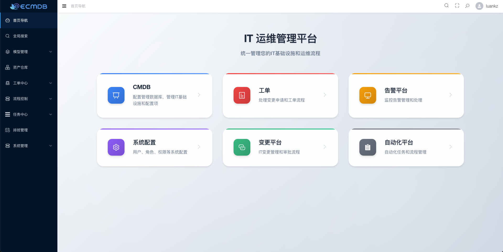
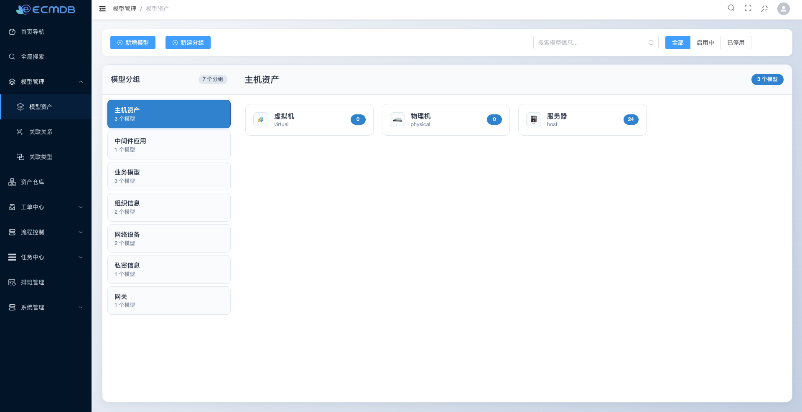
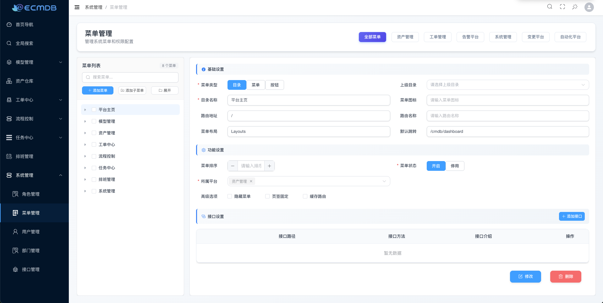
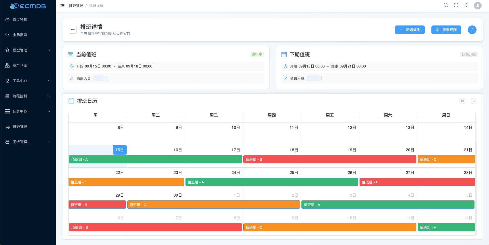
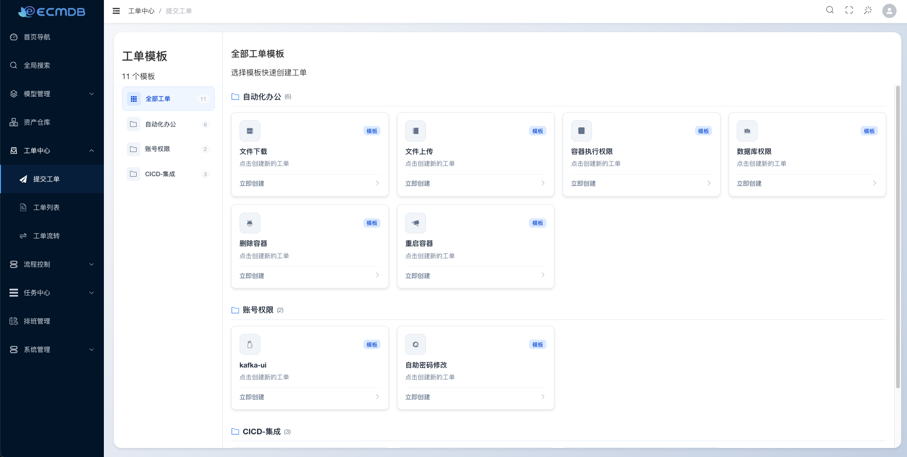
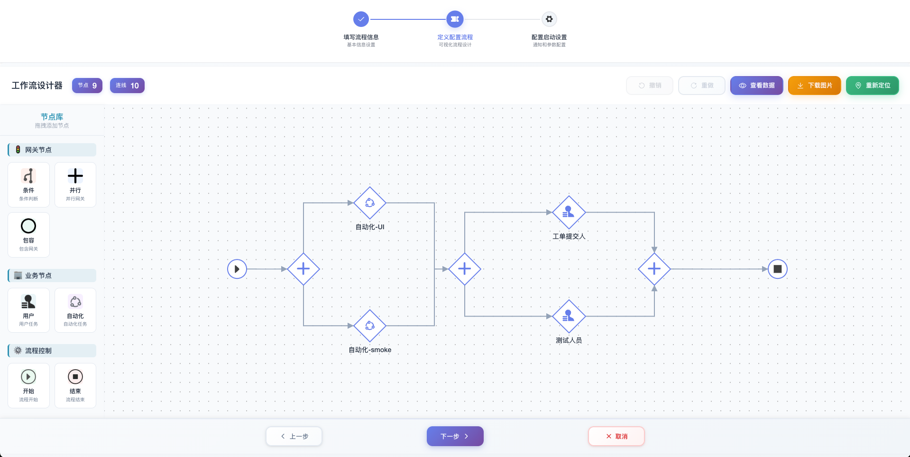
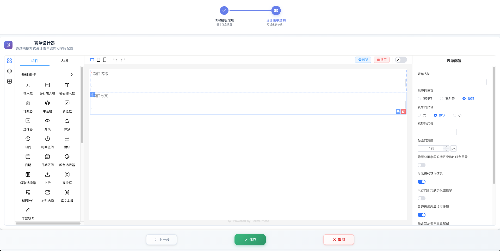
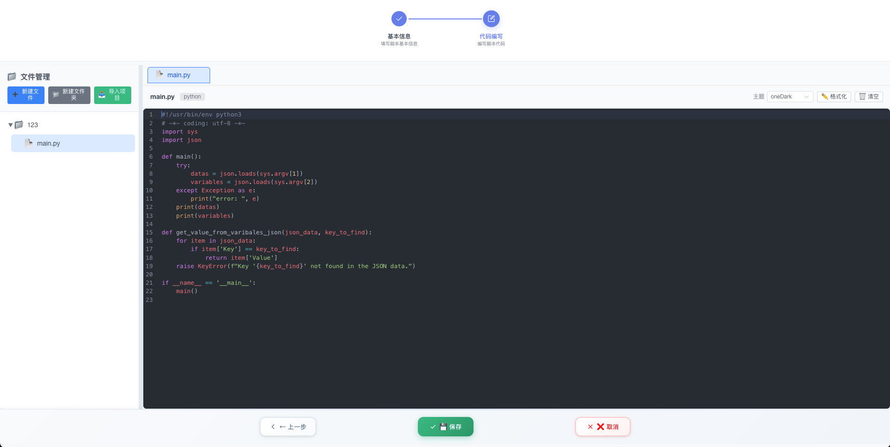
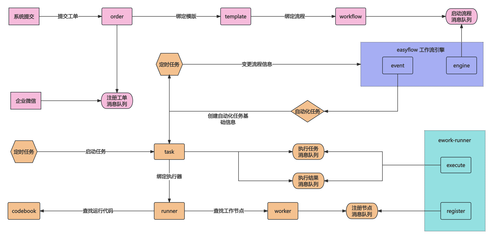

# 🚀 ECMDB - 企业级 CMDB + 工单一体化平台

<div align="center">


**现代化企业级配置管理数据库与智能工单系统**


</div>

## 🎯 核心功能

### 📊 **CMDB 资产管理**
- **模型管理**：自定义模型属性、加密属性、关联关系
- **模型属性**：支持字符串、多行文本、列表、文件
- **全文检索**：基于 Percona MongoDB 的 `ngram` 全文搜索
- **资产关联**：可视化资产关系图谱，支持复杂关联查询
- **Web 终端**：定制化模型集成 SSH/SFTP 功能，支持远程资产操作

### 📋 **工单流程中心**
- **可视化流程设计**：拖拽式流程设计器，支持或签、并签、会签、抄送等复杂流程
- **自定义表单**：基于 form-create 的动态表单生成
- **自动化任务**：支持定时任务、重试机制、变量篡改等高级功能
- **智能调度**：根据模板字段自动发现执行节点
- **消息集成**：深度集成飞书消息通知，可以在飞书完成审批工作

### 👥 **权限管理系统**
- **多认证方式**：支持 LDAP、账号密码等多种登录方式
- **细粒度权限**：支持菜单、按钮、API 接口的精细化权限控制
- **动态权限**：基于 Casbin 的灵活权限策略配置
- **部门管理**：支持组织架构管理和人员分组

### 📅 **排班管理系统**
- **灵活排班规则**：支持日、小时时间单位的排班
- **智能调度算法**：基于 RRULE 算法的排班计算
- **临时调班**：支持临时调班规则和特殊排班需求
- **可视化排班表**：直观的排班表展示和预览功能
> 💡 **提示**：当前排班功能开发完成，暂时还没和本系统模块进行集成

## 🏗️ 技术架构

### 后端技术栈
- **语言框架**：Go 1.21+ + Gin + GORM
- **数据库**：Percona MongoDB + MySQL + Redis Stack
- **消息队列**：Kafka + Etcd
- **权限控制**：Casbin + JWT
- **流程引擎**：Easy-Workflow
- **依赖注入**：Google Wire

### 前端技术栈
- **框架**：Vue 3 + TypeScript
- **UI 组件**：Element Plus
- **状态管理**：Pinia
- **构建工具**：Vite

### 部署运维
- **容器化**：Docker + Docker Compose
- **CI/CD**：Github Action 自动构建镜像

## 🚀 快速开始

### 系统要求
- Go 1.21+
- Docker & Docker Compose
- MongoDB 4.4+
- MySQL 8.0+
- Redis 6.0+

### 一键部署
```bash
# 创建网络
docker network create ecmdb

# 启动服务
docker compose -p ecmdb -f deploy/docker-compose.yaml up -d

# 初始化系统
docker exec -it ecmdb ./ecmdb init
```

### 默认账户
- **用户名**：admin
- **密码**：123456

## 📈 项目现状

当前系统已进入 **GA（General Availability）** 阶段，核心功能稳定可靠，欢迎企业级用户使用！

- ✅ **CMDB 模块**：功能完整，性能优化
- ✅ **工单系统**：流程引擎稳定，支持复杂业务场景
- ✅ **权限管理**：安全可靠，支持多种认证方式
- ✅ **排班管理**：算法优化，支持灵活排班需求

## 🤝 贡献指南

我们欢迎所有形式的贡献！如果您想参与项目开发，请：

1. Fork 本仓库
2. 创建特性分支 (`git checkout -b feature/AmazingFeature`)
3. 提交更改 (`git commit -m 'Add some AmazingFeature'`)
4. 推送到分支 (`git push origin feature/AmazingFeature`)
5. 创建 Pull Request


## 🔗 关联项目

本项目完整运行，包含以下核心组件：

| 项目 | 描述 | 仓库地址 |
|------|------|----------|
| **前端界面** | Vue3 + TypeScript 现代化前端 | [ecmdb-web](https://github.com/Duke1616/ecmdb-web) |
| **任务执行器** | 分布式任务执行引擎 | [ework-runner](https://github.com/Duke1616/ework-runner) |
| **消息通知** | 统一消息通知服务 | [enotify](https://github.com/Duke1616/enotify) |

> 💡 **提示**：如果没有工单自动化任务需求，可以不部署任务执行器

## 🎨 界面展示

### 🖥️ 系统界面展示

|  |  |
|:--------------------------:|:------------------------------:|
| **首页导航** | **CMDB 资产管理** |
|  |  |
| **菜单管理** | **排班管理** |
|  |  |
| **工单列表** | **流程控制** |
|  |  |
| **模版管理** | **自动化代码库** |

### 自动化任务流程图



## 🏗️ 系统架构

### 模块化开发
```
ecmdb/
├── internal/
│   ├── model      # CMDB - 模型管理
│   ├── attribute  # CMDB - 字段属性
│   ├── resource   # CMDB - 资产数据
│   ├── relation   # CMDB - 关联关系
│   ├── order      # 工单 - 工单信息
│   ├── workflow   # 工单 - 流程图
│   ├── template   # 工单 - 工单模版
│   ├── task       # 工单 - 自动化任务
│   ├── runner     # 工单 - 执行单元
│   ├── worker     # 工单 - 工作节点
│   ├── codebook   # 工单 - 代码库
│   ├── discovery  # 工单 - 自动发现
│   ├── rota       # 排班 - 排班模块
│   ├── user       # 权限 - 用户模块
│   ├── role       # 权限 - 角色管理
│   ├── department # 权限 - 部门管理
│   ├── menu       # 权限 - 菜单管理
│   ├── permission # 权限 - 权限控制
│   └── terminal   # 终端 - Web终端
```


## 📚 开发指南

### 本地开发
```bash
# 1. 安装依赖
go mod tidy

# 2. 启动服务
go run main.go start

# 3. 初始化数据
go run main.go init
```

### 代码生成
```bash
# 更新菜单
bash ./scripts/update-menu.sh
```

## 🔧 高级配置

### 企业微信集成
支持企业微信 OA 回调消息，实现自动化任务执行

### LDAP 认证
支持企业 LDAP 认证，配置示例：

```yaml
ldap:
  enabled: true
  host: ldap.company.com
  port: 389
  base_dn: "dc=company,dc=com"
  user_dn: "cn=admin,dc=company,dc=com"
  password: "admin_password"
```

## 🛡️ 安全特性

- **数据加密**: 敏感数据 AES 加密存储
- **权限控制**: 基于 Casbin 的细粒度权限管理
- **API 安全**: 菜单权限 + 接口鉴权

## 🚀 下一阶段规划

### 🔔 **智能告警系统** (v2.0.0 - 开发中)
- **多源告警接入**：支持 Prometheus、Loki 等主流监控系统
- **智能告警聚合**：基于规则引擎的告警去重、降噪和聚合
- **告警转工单**：自动将告警转换为工单，实现闭环管理
- **告警升级**：基于严重程度和时间的自动升级机制
- **可视化大屏**：实时告警监控大屏，支持自定义仪表板

### 🔄 **变更管理系统** (v2.1.0 - 规划中)
- **变更审批流程**：标准化的变更申请、审批、执行流程
- **影响分析**：自动分析变更对系统的影响范围
- **回滚机制**：支持变更回滚和版本管理
- **变更日历**：变更窗口管理和冲突检测
- **合规审计**：完整的变更记录和审计跟踪
- **自动化部署**：与 CI/CD 集成的自动化变更执行

## 📈 版本历史

### v2.0.0 (开发中)
- 🔄 智能告警系统开发
- 🔄 告警转工单功能
- 🔄 多渠道通知集成

### v1.9.0 (当前版本)
- ✅ 优化工单消息通知
- ✅ 修复部分已知的问题
- ✅ 完善排班管理功能

### v1.7.0
- ✅ 新增排班管理模块
- ✅ 优化自动化任务执行
- ✅ 增强权限控制功能
- ✅ 改进用户界面体验

### v1.6.0
- ✅ 集成 Web 终端功能
- ✅ 新增自动发现机制
- ✅ 优化工单流程引擎

### v1.0.0
- ✅ 基础 CMDB 功能
- ✅ 工单流程系统
- ✅ 权限管理模块

## 🤝 社区支持

### 问题反馈
- **GitHub Issues**: [提交问题](https://github.com/Duke1616/ecmdb/issues)
- **功能建议**: [功能请求](https://github.com/Duke1616/ecmdb/discussions)

### 技术交流
- **微信**: 添加微信 lkz-1008
- **邮件**: 通过 GitHub Issues 联系

## 📄 许可证

本项目采用 [MIT 许可证](LICENSE)，允许自由使用、修改和分发。

---

<div align="center">

**🌟 如果这个项目对您有帮助，请给我们一个 Star！**

**💡 欢迎贡献代码，一起打造更好的企业级 CMDB 平台！**

Made with ❤️ by [Duke1616](https://github.com/Duke1616)

</div>
