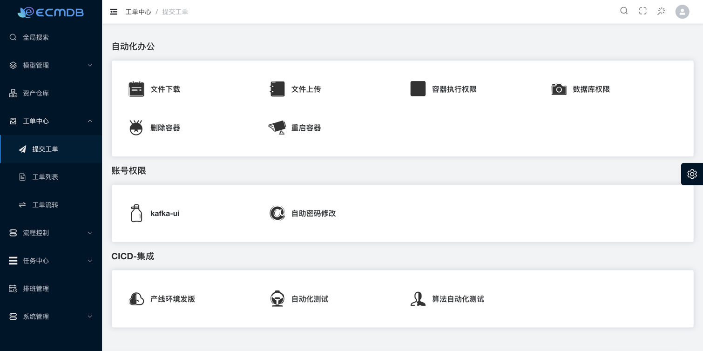
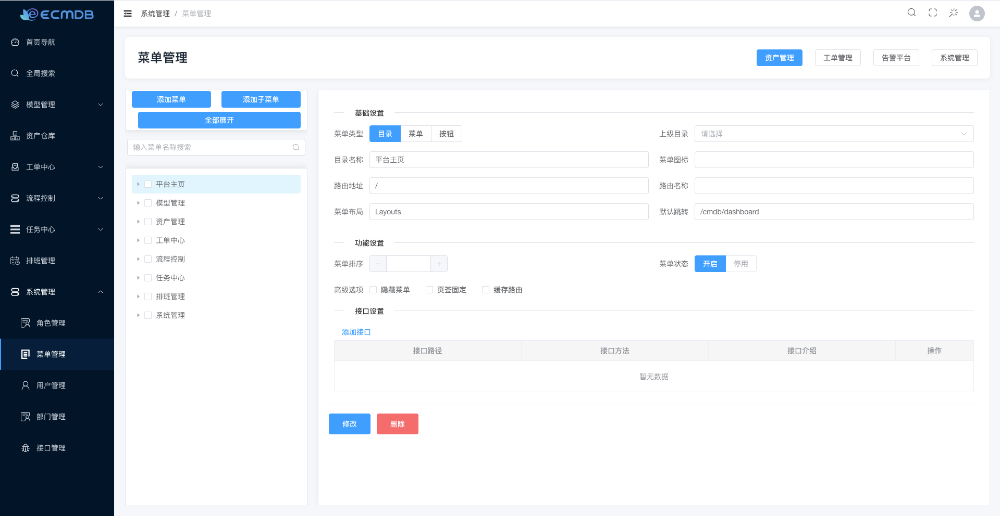

# ecmdb
## 前言
这个系统最初设计是为了业余学习以及结合工作需求开发的，目标是创建一个CMDB资产管理系统。完成初步开发后，
发现仅仅记录资产信息并不能完全体现平台的价值，且不支持自动化录入显得功能过于单薄。

经过一段时间的思考后，决定将项目方向调整为工单系统。借助工单系统的能力，实现数据的自动化录入到CMDB中。起初考虑重新建立一个仓库来开发这个系统，但由于人手和精力有限，最终选择在原有仓库中进行编写和完善。

最后希望能找到志同道合的伙伴，一起参与到这个项目，共同协同开发，如果有感兴趣的，可以联系我。

wx: lkz-1008

## 项目部署
### docker
```shell
# 创建一个新的虚拟网络
docker create network ecmdb

# 启动服务
docker compose -p ecmdb -f deploy/docker-compose.yaml up -d

# 初始化数据库

# 销毁环境
docker compose -p ecmdb -f deploy/docker-compose.yaml down
```

## 关联项目
具体内容请查看相关项目，如果没有工单自动化任务需求，可以不部署任务执行器
- 前端： https://github.com/Duke1616/ecmdb-web
- 任务执行器：https://github.com/Duke1616/ework-runner

## 功能
- CMDB
  - 全文检索、针对资产数据全文检索
  - 提供了模型的抽象管理，自定义模型属性
  - 模型关联关系、资产关联关系
- 工单系统
  - 集成了Easy-Workflow流程引擎，支持或签、并签、判断、会签、自动化
  - 支持绑定自定义脚本执行自动化任务
  - 支持接收企业微信OA回调消息、转换自动化任务执行
    - 接收企业微信数据请自行开发、只要把消息推送到 `wechat_callback_events` 消息队列中即可, 如有需要，可以联系我进行咨询，提供具体方案思路
  - 自动化任务支持篡改变量、篡改输入，任务重试
- 用户权限
  - 支持 LDAP 登录
  - 支持前端动态菜单、按钮、后端API鉴权

## 技术栈
- 数据库：MongoDB、MySQL
- 中间件：Redis、kafka、Etcd、Easy-Workflow
- 框架：Gin、Gorm、Wire、Casbin

## 目录结构
```
.
├── config # 配置文件
│   └── example.yaml
├── deploy # CICD
│   ├── docker-compose.yaml
│   ├── Dockerfile
│   └── prod.yaml
├── docs  # 文档
│   └── img
├── go.mod
├── go.sum
├── internal
│   ├── model      # CMDB - 模型 CI
│   ├── attribute  # CMDB - 字段属性
│   ├── resource   # CMDB - 资产数据
│   ├── relation   # CMDB - 关联关系
│   ├── runner     # 工单 - 执行器
│   ├── task       # 工单 - 自动化任务
│   ├── template   # 工单 - 模版
│   ├── worker     # 工单 - 工作节点
│   └── workflow   # 工单 - 流程绑定
│   ├── codebook   # 工单 - 代码库
│   ├── engine     # 工单 - easyflow engine
│   ├── event      # 工单 - easyflow event 
│   ├── order      # 工单 - 工单信息
│   ├── user       # 权限 - 用户模块
│   ├── role       # 权限 - 角色管理
│   ├── endpoint   # 权限 - API接口管理
│   ├── policy     # 权限 - 集成casbin 
│   ├── menu       # 权限 - 菜单信息
│   ├── permission # 权限 - 整合鉴权
│   ├── pkg        # 通用
├── ioc # 依赖注入
│   ├── app.go
│   ├── casbin.go
│   ├── db.go
│   ├── etcd.go
│   ├── gin.go
│   ├── job.go
│   ├── ldap.go
│   ├── mq.go
│   ├── mysql.go
│   ├── redis.go
│   ├── session.go
│   ├── wire_gen.go
│   ├── wire.go
│   └── workwx.go
├── LICENSE
├── main.go # 启动
├── pkg # 二次封装
│   ├── cryptox
│   ├── ginx
│   ├── hash
│   ├── mongox
│   ├── mqx
│   ├── registry
│   └── tools
├── README.md
└── Taskfile.yaml # 类似于makeflie
```

## CMDB


## 工单系统


### 自动化任务-设计流程图
自动化任务在整改系统里面设计比较有趣的地方，也较为复杂。

通过下面这张图，可以更好的理解任务运行流程，以及如何排查定位问题。


## 权限控制
