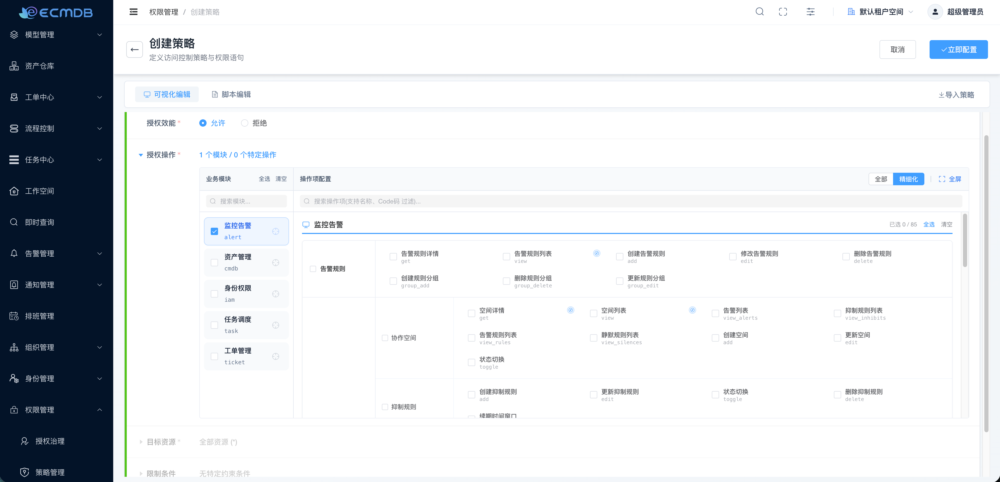

<div align="center">

# ECMDB


[](https://duke1616.github.io)
[](http://82.156.165.98:8888)

</div>

ECMDB 是一个以 CMDB 为核心的运维服务端项目。当前仓库主要提供资产模型、资产数据、模型关系、资产关系、导入导出、插件能力和终端连接等后端接口，并通过 EIAM SDK 接入登录态与权限校验。

前端界面、身份服务、工单系统、任务执行服务等由独立项目配合使用。本仓库可以单独作为 ECMDB API 服务开发，也可以通过 `deploy/docker-compose.yaml` 与其他服务一起联调。

## 主要功能

- 模型管理：支持模型、模型分组、属性、属性分组和模型关系的维护。
- 资产管理：基于自定义模型管理资产数据，支持列表、详情、搜索、加密字段读取和自定义列。
- 关系管理：维护关系类型、模型关系和资产实例关系，提供关系图谱查询接口。
- 数据导入导出：支持基于 Excel 的资产数据导入、导出和模板导出。
- 插件能力：内置插件定义、插件绑定和资源动作解析，目前包含 SSH 相关插件能力。
- 终端与文件：对接 SSH/SFTP，提供在线终端、文件浏览、上传下载、预览和基础文件操作接口。
- 权限接入：通过 EIAM SDK 做登录校验、权限校验，并在启动时同步接口权限资源。

## 项目结构

```text
.
├── api/proto              # protobuf 定义与生成配置
├── cmd                    # CLI 子命令：server、init、backup、repair、plugin
├── config                 # 本地配置示例
├── deploy                 # Dockerfile、docker-compose 与部署配置
├── docs                   # 项目说明和测试说明文档
├── init                   # 初始化菜单等内置数据
├── internal
│   ├── domain             # 领域对象
│   ├── repository         # 数据访问层
│   ├── service            # 业务逻辑
│   ├── web                # HTTP Handler
│   └── plugin             # 内置插件实现
├── ioc                    # Wire 依赖注入装配
├── pkg                    # 可复用基础包
└── scripts                # 辅助脚本
```

## 快速开始

### 使用 Docker Compose

`deploy/docker-compose.yaml` 会同时启动 ECMDB 及联调所需的 MySQL、MongoDB、Redis、Kafka、Etcd、MinIO、EIAM、EFlow、ETask、EAlert 和前端服务。

```bash
docker network create ecmdb
docker compose -p ecmdb -f deploy/docker-compose.yaml up -d
docker exec -it ecmdb ./ecmdb init
```

前端默认映射到：

```text
http://127.0.0.1:8888
```

默认管理员账号以初始化数据为准；如果使用仓库默认配置，通常为：

```text
admin / 12345678
```

### 本地运行服务端

本地运行前请先准备 MongoDB、Redis、Kafka、Etcd、MinIO，并确保 EIAM 服务可访问。配置文件默认读取 `config/config.yaml`，也可以通过 `--config` 指定。

```bash
go mod download
go run main.go init
go run main.go server --config config/config.yaml
```

常用命令：

```bash
go run main.go server
go run main.go init
go run main.go init list
go run main.go init rollback <version>
go run main.go backup list <source> <type>
go run main.go plugin import-builtin
go run main.go repair
```

## 开发命令

仓库内提供了 `Taskfile.yaml`，常用入口如下：

```bash
task run       # 启动服务
task init      # 初始化系统数据
task gen       # 生成 protobuf 代码
task mock      # 执行 go generate，生成 mock / wire 等代码
```

也可以直接运行 Go 命令：

```bash
go test ./...
go generate ./...
```

部分集成测试需要依赖外部服务和测试配置，具体可参考 [集成测试开发指南](docs/集成测试开发指南.md)。

## 配置说明

可从 `config/example.yaml` 复制一份到 `config/config.yaml` 后按环境修改。常用配置项包括：

- `web`：HTTP 服务监听地址。
- `policy`：EIAM 登录和权限校验地址。
- `mongodb`：CMDB 资产、模型和关系数据存储。
- `redis`：缓存与部分服务依赖。
- `kafka`：事件消息。
- `etcd`：服务发现与注册。
- `minio`：文件导入导出和对象存储。
- `encryption`：敏感字段加密配置。

## 相关项目

| 项目 | 说明 | 地址 |
| --- | --- | --- |
| ECMDB | 当前仓库，提供 CMDB 服务端能力 | <https://github.com/Duke1616/ecmdb> |
| ECMDB Web | ECMDB 前端界面 | <https://github.com/Duke1616/ecmdb-web> |
| EIAM | 身份、登录态和权限服务 | <https://github.com/Duke1616/eiam> |
| EFlow | 工单系统，负责工单模板、流程定义、审批流转和自动派发 | <https://github.com/Duke1616/eflow> |
| ETask | 自动化任务执行服务 | <https://github.com/Duke1616/etask> |

## 截图

|  |  |
|:---:|:---:|
| 首页导航 | CMDB 资产管理 |
|  |  |
| 权限配置 | 排班管理 |
|  |  |
| 工单列表 | EFlow 工单流程 |
|  |  |
| 工单模板 | 自动化代码库 |

## License

本项目使用 [MIT License](LICENSE)。
