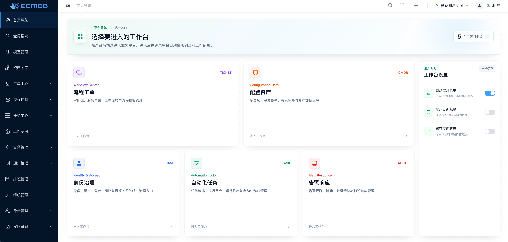
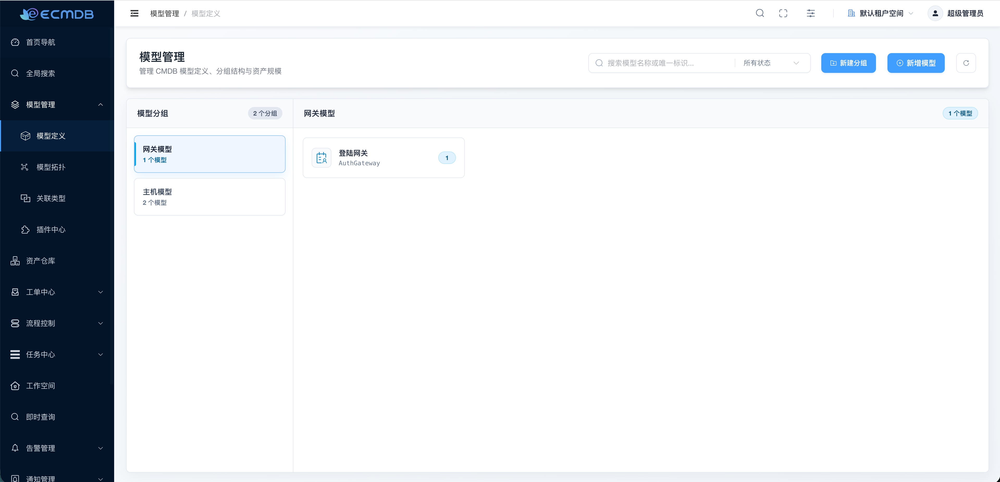
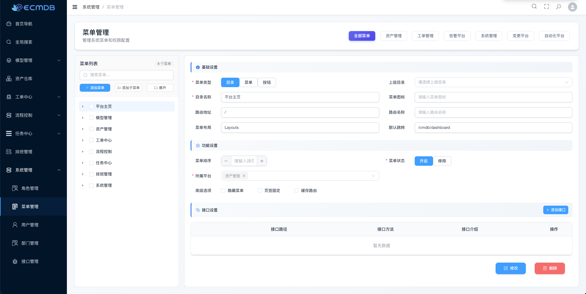
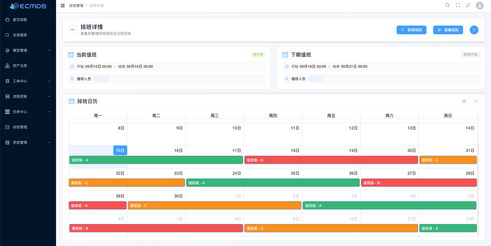
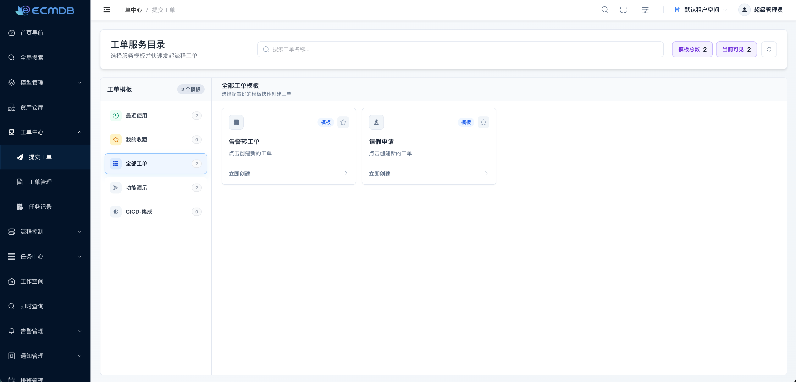
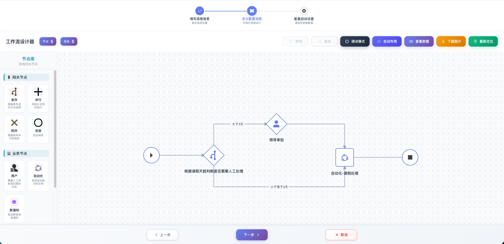
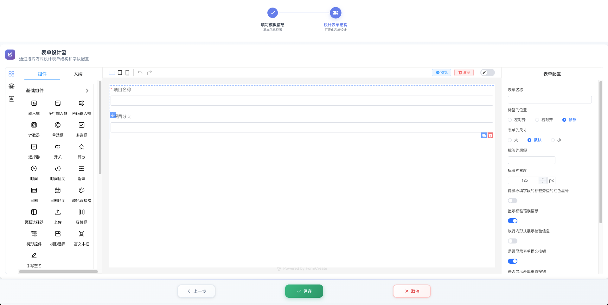
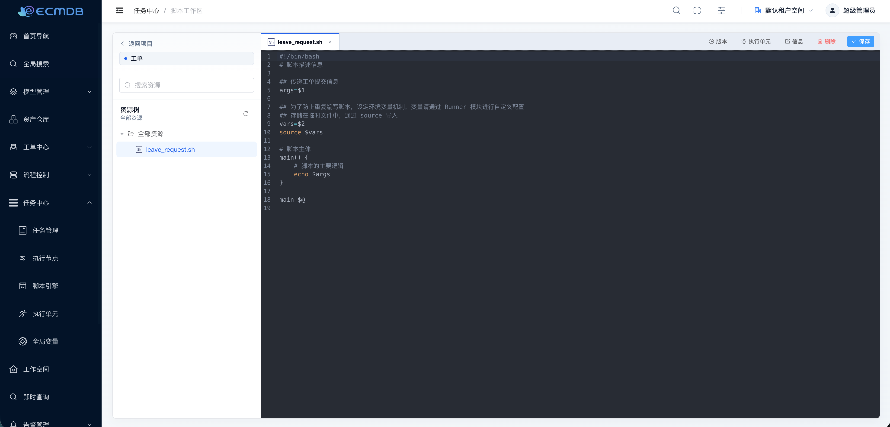
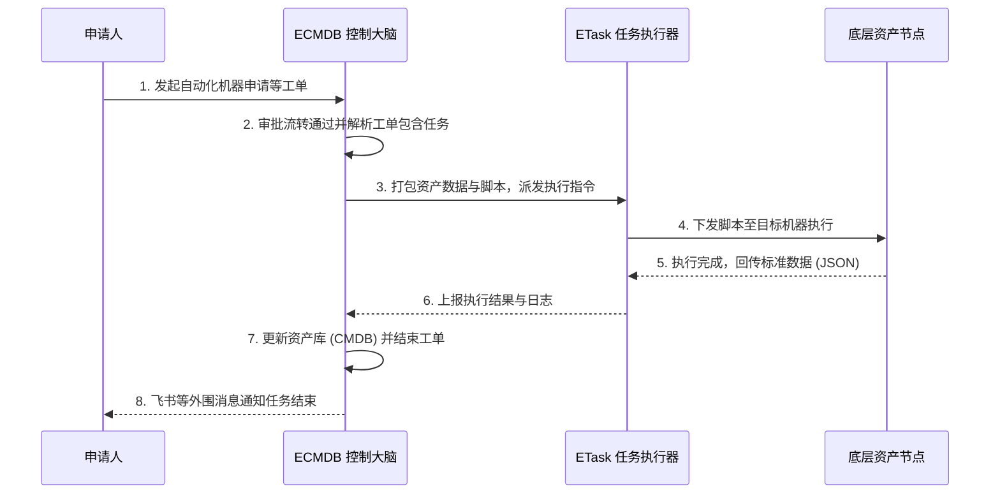

<div align="center">

# 🚀 ECMDB - 企业级运维一体化平台


[](https://duke1616.github.io)
[](http://82.156.165.98:8888)

</div>

## 🎯 核心功能

### 📊 **CMDB 资产模型引擎**
- **动态模型定制**：基于 Percona MongoDB，允许用户在前端界面自由定义资产模型（Model）与关联属性（Attribute），无需变更底层逻辑库表。
- **复杂结构存储**：对模型字段原生支持加密串、多行文本、文件、列表等常见的复杂表单元素数据存储要求。
- **全文检索引擎**：利用 `ngram` 设置对自定义的资产属性构建索引，大幅提升海量数据的聚合查询与过滤性能。
- **关联拓扑映射**：以可视化的形式记录资源与资源之间所绑定的层级关联和血源关系。
- **内置远程管理**：对指定操作模型深度集成并赋予了 Web SSH 与 SFTP 连接模块支持，用于连通资源管控最后一公里。

### 📋 **工单与流程流转分析**
- **低代码流程编排**：深度结合 `Easy-Workflow`，具备前台拖拽绘制审批节点的流向设计，内置有会签、或签、条件分支、多维阅办等核心审批流逻辑场景。
- **动态表单与配置**：应用 `Form-Create` 组件，做到申请填报内容和附加挂载表单页面所见即所得、保存即生效。
- **业务灵活组装**：允许将诸如“应用上下线”、“权限管控变更”等带有特定业务操作节点的工单实现全配置化发布，无需侵入编写额外源码。
- **协同消息触达**：针对审批流转全生命周期深度绑定类似飞书等协作网关，直接在消息终端里触达与处理工单事务。

### 👥 **权限认证中心服务**
- **多层级越权防堵**：基于体系内的 Casbin 组件完成“权限矩阵控制”，粒度覆盖从基本的路由端点接口一直细化到 Web 端的隐形触发按钮判定拦截。
- **协议跨越登录**：用户基础系统支持平台本地直连登录外，平滑扩展了对企业原有 LDAP 服务通道账号数据的并打通支持。

### �️ **值日人员排班算法**
- **高频率维度计算**：使用强大的 `RRULE` 规则生成策略，实现能够对齐精确支持跨越多业务组、细小至日/小时的轮值倒班演算计算。
- **连值检测与微调**：内置用于对换班时的临时调出/迁入补偿调节、与系统硬性规定的“防疲劳连班规则”监测模块。

## 🚀 快速开始

### 🌐 在线演示
**立即体验**：无需安装，直接访问在线演示环境
- **演示地址**：[http://82.156.165.98:8888](http://82.156.165.98:8888)
- **演示账户**：demo / **密码**：123456
> 💡 **提示**：演示环境拥有平台的读取权限。

### 本地部署 (Docker Compose)
```bash
# 创建网络
docker network create ecmdb

# 启动服务
docker compose -p ecmdb -f deploy/docker-compose.yaml up -d

# 初始化系统内置数据
docker exec -it ecmdb ./ecmdb init

# 初始化工单飞书通知模版 (可选)
go run main.go init ticket-notify-template
```
> **默认管理员账户：**`admin` / `123456`


## 🎨 界面展示

### 🖥️ 系统界面展示

|  |  |
|:--------------------------:|:------------------------------:|
| **首页导航** | **CMDB 资产管理** |
|  |  |
| **菜单管理** | **排班管理** |
|  |  |
| **工单列表** | **流程控制** |
|  |  |
| **模版管理** | **自动化代码库** |

### ⚙️ 自动化任务控制流转图

系统在处理自动化工单节点时，通过内置的主控模块与底层 ETask 执行集群的深度配合，完成了从“凭证聚合”到“流程自动化闭环”的安全沙盒流转：


```mermaid
sequenceDiagram
    participant User as 申请人
    participant ECMDB as ECMDB 控制大脑
    participant ETask as ETask 任务执行器
    participant Node as 底层资产节点

    User->>ECMDB: 1. 发起自动化机器申请等工单
    ECMDB->>ECMDB: 2. 审批流转通过并解析工单包含任务
    ECMDB->>ETask: 3. 打包资产数据与脚本，派发执行指令
    
    ETask->>Node: 4. 下发脚本至目标机器执行
    Node-->>ETask: 5. 执行完成，回传标准数据 (JSON)

    ETask-->>ECMDB: 6. 上报执行结果与日志
    ECMDB->>ECMDB: 7. 更新资产库 (CMDB) 并结束工单
    ECMDB-->>User: 8. 飞书等外围消息通知任务结束
```


## 🏗️ 架构与技术体系

本项目包含服务端主控程序以及关联的多个支撑生态工程，以实现完整的运维流转闭环。

### 🔗 生态工程构成
| 项目主仓库 | 平台角色与职责说明 | 开源地址 |
|:------|:------|:----------|
| **ECMDB** | 提供平台底层处理架构，涵盖自定义资产模型重算、内部审批引擎与整体资源 API 调度服务。 | [ecmdb](https://github.com/Duke1616/ecmdb) |
| **ECMDB-WEB** | 基于 Vue 3 构建的交互操作层，负责将动态表单与可拖拽审批流程图等可视化投射给终端用户。 | [ecmdb-web](https://github.com/Duke1616/ecmdb-web) |
| **ETask** | 隔离于核心之外，专门承接主机节点网络穿透，及长效执行脚本（Shell/Python等）指令派发解析的节点引擎。 | [etask](https://github.com/Duke1616/etask) |
| **EAlert** | 从多数据源提取监控特征并智能降噪，同时支持通过故障告警直接触发并驱动下游维保工单自动流转的子系统。 | 暂未开源 |
| **ENotify** | 系统侧全量外围消息的收口分发服务，集中化桥接包括飞书、邮件等下发媒介的最终投递网关。 | [enotify](https://github.com/Duke1616/enotify) |

### 💻 后端核心技术栈
- **开发框架**：Go、Ego、Gin、gRPC
- **持久化层**：Percona MongoDB、MySQL
- **缓存与队列**：Redis、Kafka
- **服务治理**：Etcd
- **内置引擎库**：Casbin、Google Wire、easy-workflow

### 🎨 前端界面构建技术栈
- **语言框架**：TypeScript、Vue 3
- **工程构建**：Vite 
- **状态维持**：Pinia
- **UI 组件库**：Element Plus


## 📚 本地开发指南

所有的命令行快捷入口均由仓库内的 `Taskfile.yaml` 分发统筹。请确保本地存在 MySQL、MongoDB 等前置环境要素。

### 1. 基础环境与代码生成
```bash
# 同步并清理 Go 模块包
go mod tidy

# 重新生成基于内部规范的 gRPC Protobuf 协议文件
task gen

# 使用 Wire 重新分析生成控制反转 (Provider) 安全依赖树
task wire
```

### 2. 初始化与服务接管
```bash
# 执行数据库表结构迁移与默认账密内置初始化
task init

# 启动 ECMDB 主控制器API服务（前台运行）
task run

# 向网关重新收集并同步最新的路由与资源端点
task endpoint
```

<div align="center">

**🌟 如果这个项目对您有帮助，请给我们一个 Star！**

**💡 欢迎贡献代码，一起打造更好用的现代级 CMDB 运维底座！**

Made with ❤️ by [Duke1616](https://github.com/Duke1616)

</div>
