<div align="center">

# ECMDB · 一体化运维管理平台


[](https://duke1616.github.io)
[](http://www.fleetops.top)

</div>

---

## 为什么选择 ECMDB？

在现代基础设施环境下，运维团队往往面临**工具分散、数据孤岛、定制成本高**的困扰。

ECMDB 不仅仅是配置管理，而是提供涵盖**资产拓扑、工单流程、自动化作业与监控告警**的一体化综合运维协同平台：

- **功能全面，松耦合可插拔**  
  覆盖资产、流程、任务、告警与权限完整闭环。各子服务既能统一门户协同运作，也可按需单独部署、自由插拔。

- **动态模型，告别刚性结构**  
  基于 Schema-less 动态分表，零改表成本即可自由扩展模型属性与关联拓扑，让资产中枢随业务敏捷演进。

- **契约清晰，核心功能灵活扩展**  
  资产不仅是静态账本，更是操作入口。支持通过 ECMDB Plugins 针对专有设备定制操作插件，同时 ETask 原生支持实现与接入自定义作业执行器。

- **开箱即用，极速交付体验**  
  单套 Docker Compose 编排，5 分钟即可在本地或私有云完整拉起全套微服务套件，开箱即用。

---

## 系统架构

<div align="center">

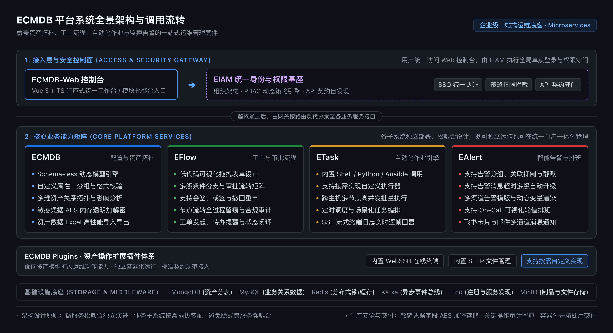

</div>

---

## 界面展示

| 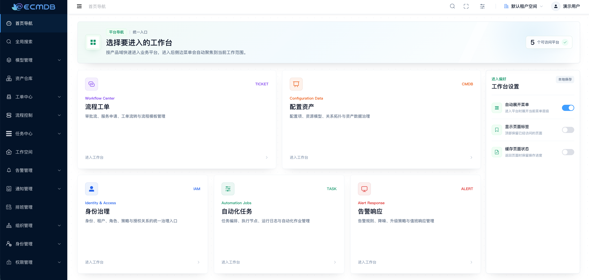 |     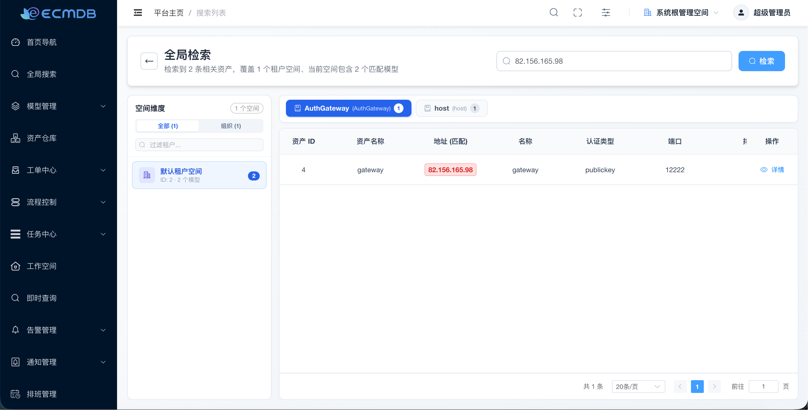     |
|:--------------------------------:|:-----------------------------------------:|
|               首页导航               |                   全局搜索                    |
| 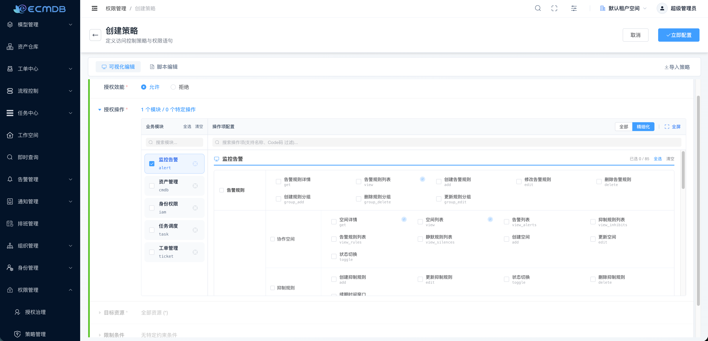   |     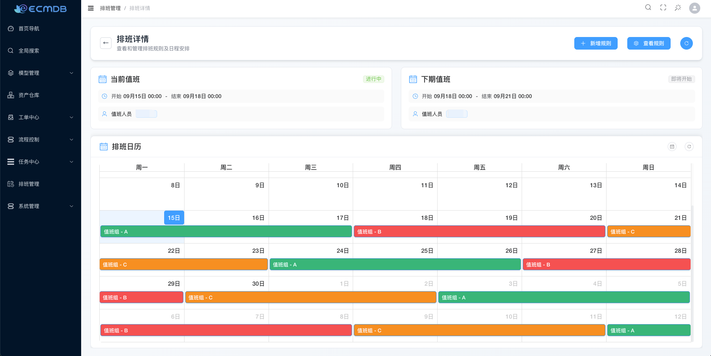      |
|               权限配置               |                   排班管理                    |
| 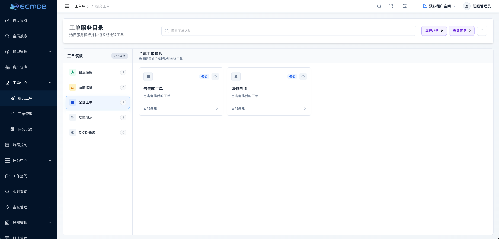 | 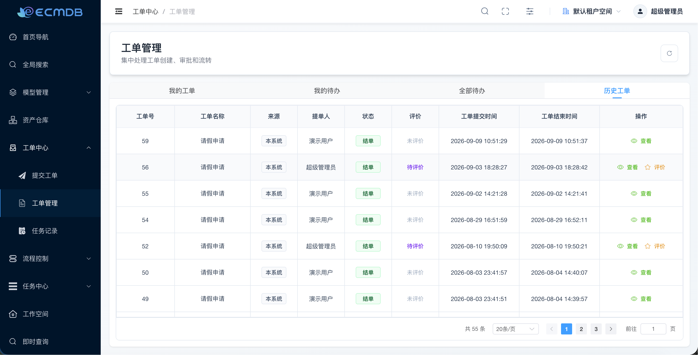      |
|               工单列表               |                  工单历史                   |
| 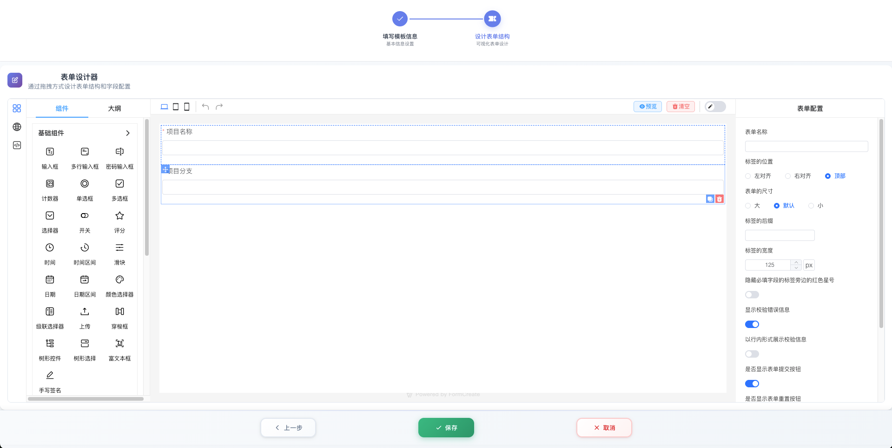 |   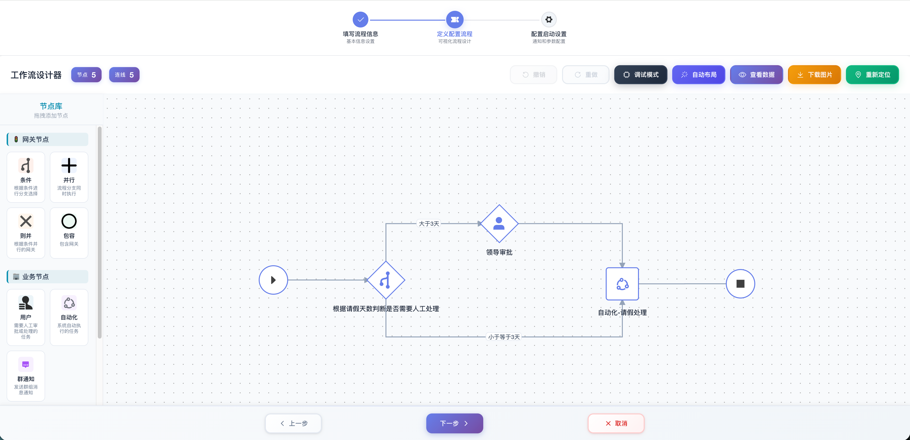   |
|               工单模板               |                  工单流程                   |
| 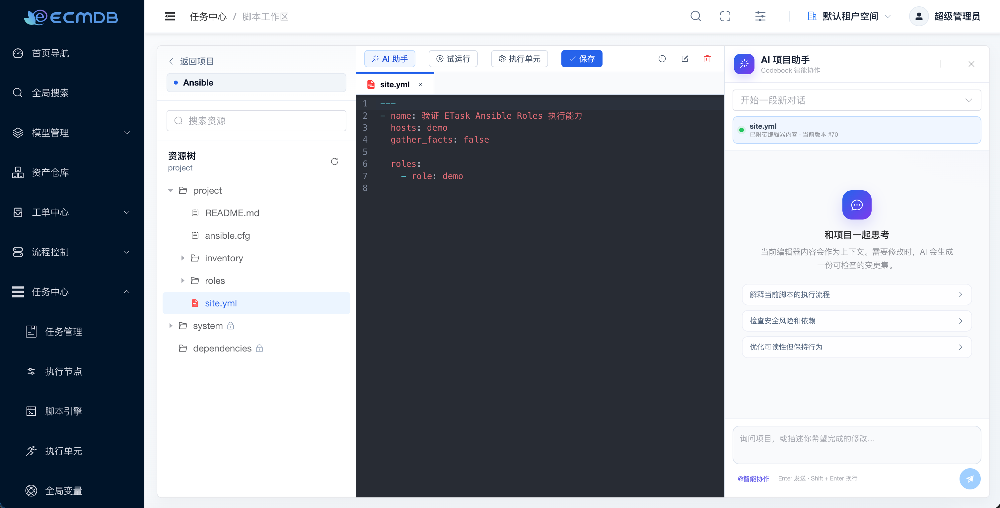 |   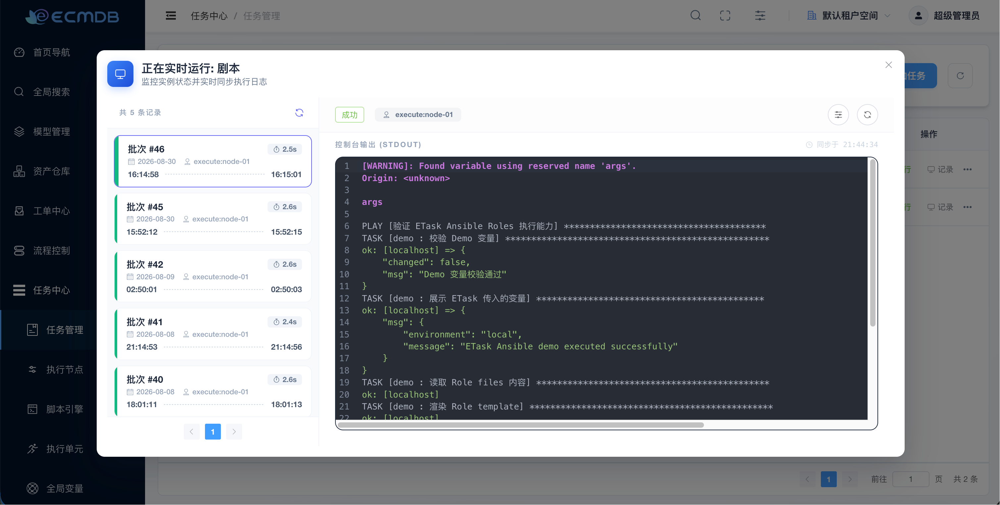   |
|               脚本引擎              |                  执行记录                   |
---

## 快速开始

使用 Docker Compose 可以快速拉起全套服务进行体验：

```bash
# 1. 创建共享网络
docker network create ecmdb

# 2. 启动全套服务（包含 ECMDB、EIAM、EFlow、ETask、EAlert、Web 前端及基础中间件）
docker compose -p ecmdb -f deploy/docker-compose.yaml up -d

# 3. 初始化内置元数据与管理员权限
docker exec -it ecmdb ./ecmdb init
```

服务启动后，浏览器访问：
- **Web 控制台**：`http://127.0.0.1:8888`
- **默认账号**：`admin` / `12345678`

---

## 本地开发

### 1. 运行与初始化

本地启动前请先准备好依赖中间件

```bash
# 下载依赖
go mod download

# 初始化系统基础模型与数据
task init

# 启动 ECMDB API 服务端（默认读取 config/config.yaml）
task run
```

### 2. 开发指令集（基于 [Taskfile.yaml](Taskfile.yaml)）

项目通过 `task` 统一规范化管理本地开发、代码生成与契约同步任务：

```bash
# --- 运行与初始化 ---
task init            # 初始化系统基础模型、属性分组与内置数据
task run             # 启动 ECMDB API 服务端

# --- 代码与契约生成 ---
task gen             # 全量代码与契约生成（一次性串联执行 wire + proto + perm）
task wire            # 生成 ioc 依赖注入代码 (wire ./ioc/)
task proto           # 基于 buf 生成 Protobuf / gRPC 桩代码 (buf generate)
task perm            # 运行 AST 权限扫描，生成强类型权限契约及文档 (permgen)
task swagger         # 生成 OpenAPI 3.0 / Swagger 接口文档与交互页面
task mock            # 执行单元测试 Mock 代码生成 (go generate ./...)
task arch            # 基于纯 Go 无头浏览器批量渲染系统架构图至 docs/img/

# --- 工具链安装 ---
task install:tools   # 一键安装生态工具链 (wire, permgen, swaggergen)
```

---

## 项目矩阵

ECMDB 采用模块化多仓库设计，各子系统独立演进：

| 模块 | 职责定位 | 稳定版本 | 仓库地址 |
| :--- | :--- | :---: | :--- |
| **ECMDB** | 配置管理中枢、资产拓扑与插件控制面（本仓库） | `v1.11.5` | [Duke1616/ecmdb](https://github.com/Duke1616/ecmdb) |
| **ECMDB Web** | 统一管理控制台前端（Vue 3 + TS 现代化交互） | `v1.11.0` | [Duke1616/ecmdb-web](https://github.com/Duke1616/ecmdb-web) |
| **ECMDB Plugins** | 资产操作扩展插件（含 WebSSH 在线终端、SFTP 文件管理等） | `v0.1.2` | [Duke1616/ecmdb-plugins](https://github.com/Duke1616/ecmdb-plugins) |
| **EFlow** | 企业级低代码工作流与工单审批引擎 | `v0.0.2` | [Duke1616/eflow](https://github.com/Duke1616/eflow) |
| **ETask** | 分布式自动化运维作业执行引擎 | `v1.14.1` | [Duke1616/etask](https://github.com/Duke1616/etask) |
| **EIAM** | 企业级统一身份凭证与细粒度权限管理中心 | `v0.0.24` | [Duke1616/eiam](https://github.com/Duke1616/eiam) |

---

## License

本项目遵循 [MIT License](LICENSE) 开源协议。
