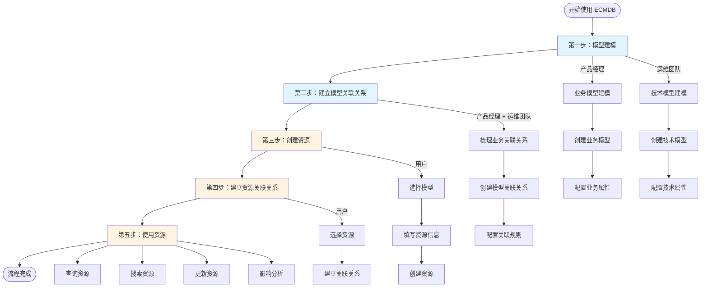
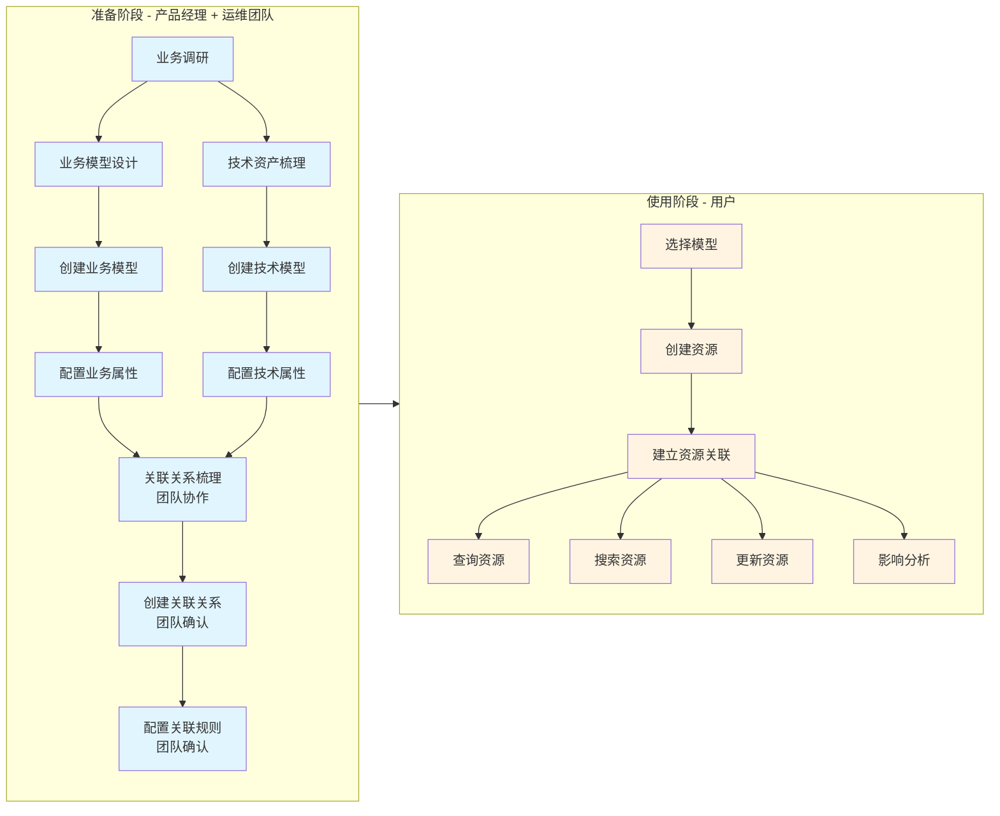

# 资源管理流程说明

本文档从用户使用角度描述了 ECMDB 系统中资产模型建模、关联关系建立、资源创建和使用的完整流程。

## 📋 流程概览



## 🔄 完整流程说明

### 第一阶段：模型建模

#### 1.1 业务模型建模（产品经理）

**参与者**：产品经理 + 业务团队

**说明**：产品经理负责设计和创建业务层面的模型，如客户单位、业务系统、项目等业务实体。

**流程步骤**：

```
1. 产品经理深入业务团队调研
   ├─ 了解业务实体类型（客户单位、业务系统、项目等）
   ├─ 梳理业务实体的属性需求（单位名称、系统名称、项目状态等）
   └─ 调研业务使用场景和查询需求

2. 产品经理设计业务模型
   ├─ 定义模型名称（如：客户单位、业务系统、项目）
   ├─ 设计模型属性（如：单位名称、系统名称、负责人等）
   ├─ 确定属性类型（字符串、数字、日期、枚举等）
   └─ 标记必填字段和加密字段

3. 产品经理创建业务模型
   ├─ 登录 ECMDB 系统
   ├─ 进入"模型管理"模块
   ├─ 点击"创建模型"按钮
   ├─ 填写模型信息（模型名称、描述、分组）
   └─ 保存模型

4. 产品经理配置模型属性
   ├─ 进入"属性管理"页面
   ├─ 添加业务属性（如：单位名称、系统名称、负责人等）
   └─ 保存属性配置
```

**示例业务模型**：
- 客户单位模型：单位名称、统一社会信用代码、行业类型、联系人、联系方式等属性
- 业务系统模型：系统名称、系统类型、负责人、所属单位、上线时间、系统状态等属性
- 项目模型：项目名称、项目类型、负责人、所属单位、开始时间、结束时间、项目状态等属性

**输出**：业务模型设计文档和已创建的业务模型

---

#### 1.2 技术模型建模（运维团队）

**参与者**：运维团队

**说明**：运维团队负责设计和创建技术层面的模型，如服务器、应用、数据库等基础设施。

**流程步骤**：

```
1. 运维团队梳理技术资产类型
   ├─ 识别需要管理的技术资产（服务器、应用、数据库等）
   ├─ 梳理技术资产的属性需求（IP、CPU、内存、端口等）
   └─ 调研技术资产的管理场景

2. 运维团队设计技术模型
   ├─ 定义模型名称（如：服务器、应用、数据库）
   ├─ 设计模型属性（如：IP地址、CPU、内存）
   ├─ 确定属性类型（字符串、数字、枚举等）
   └─ 标记必填字段和加密字段

3. 运维团队创建技术模型
   ├─ 登录 ECMDB 系统
   ├─ 进入"模型管理"模块
   ├─ 点击"创建模型"按钮
   ├─ 填写模型信息（模型名称、描述、分组）
   └─ 保存模型

4. 运维团队配置模型属性
   ├─ 进入"属性管理"页面
   ├─ 添加技术属性（如：IP地址、主机名、CPU、内存等）
   └─ 保存属性配置
```

**示例技术模型**：
- 服务器模型：IP、主机名、CPU、内存、磁盘、操作系统等属性
- 应用模型：应用名、版本、端口、部署路径、运行环境等属性
- 数据库模型：数据库名、类型、端口、连接串、版本等属性

**输出**：技术模型设计文档和已创建的技术模型

---

### 第二阶段：建立模型关联关系（产品经理 + 运维团队）

#### 2.1 梳理关联关系

**参与者**：产品经理 + 运维团队 + 业务团队

**说明**：需要梳理三类关联关系：
1. **业务模型之间的关联**：如业务系统关联客户单位、项目关联客户单位
2. **业务模型与技术模型的关联**：如业务系统关联应用、业务系统关联数据库
3. **技术模型之间的关联**：如应用部署在服务器、应用依赖数据库

**流程步骤**：

```
1. 梳理业务模型之间的关联关系（产品经理主导）
   ├─ 产品经理调研业务逻辑：
   │  ├─ 业务系统关联哪些客户单位？
   │  ├─ 项目关联哪些客户单位？
   │  ├─ 客户单位有哪些业务系统？
   │  └─ 业务系统有哪些项目？
   └─ 业务团队确认关联关系是否符合业务逻辑

2. 梳理业务模型与技术模型的关联关系（团队协作）
   ├─ 产品经理说明业务需求：
   │  ├─ 业务系统对应哪些应用？
   │  ├─ 业务系统使用哪些数据库？
   │  └─ 业务系统依赖哪些基础设施？
   ├─ 运维团队说明技术实现：
   │  ├─ 业务系统运行在哪些服务器上？
   │  ├─ 业务系统数据存储在哪些数据库中？
   │  └─ 业务系统依赖哪些中间件？
   └─ 团队讨论确定关联关系

3. 梳理技术模型之间的关联关系（运维团队主导）
   ├─ 运维团队说明实际运行情况：
   │  ├─ 应用运行在哪些服务器上？
   │  ├─ 应用依赖哪些数据库？
   │  ├─ 数据库部署在哪些服务器上？
   │  └─ 其他技术资产之间的依赖关系？
   └─ 产品经理了解技术架构，便于业务分析

4. 团队讨论关联关系类型
   ├─ 业务模型关联：业务系统 → 客户单位（多对一）、项目 → 客户单位（多对一）
   ├─ 业务与技术关联：业务系统 → 应用（一对多）、业务系统 → 数据库（一对多）
   └─ 技术模型关联：应用 → 服务器（多对多）、应用 → 数据库（多对一）
```

**输出**：关联关系设计文档（团队确认）

---

#### 2.2 创建模型关联关系

**参与者**：产品经理 + 运维团队

**流程步骤**：

```
1. 创建业务模型之间的关联关系（产品经理）
   ├─ 产品经理进入"关联关系管理"模块
   ├─ 创建关联关系：业务系统 → 客户单位
   │  ├─ 关系名称：业务系统归属客户单位
   │  ├─ 关系类型：多对一
   │  └─ 关系描述：多个业务系统可以属于一个客户单位
   ├─ 创建关联关系：项目 → 客户单位
   │  ├─ 关系名称：项目归属客户单位
   │  ├─ 关系类型：多对一
   │  └─ 关系描述：多个项目可以属于一个客户单位
   └─ 业务团队审核确认

2. 创建业务模型与技术模型的关联关系（团队协作）
   ├─ 产品经理和运维团队共同讨论
   │  ├─ 确认业务系统对应哪些技术资产（应用、数据库等）
   │  ├─ 确认关联关系的合理性
   │  └─ 确认关联规则是否符合实际运行情况
   ├─ 产品经理创建关联关系：业务系统 → 应用
   │  ├─ 关系名称：业务系统包含应用
   │  ├─ 关系类型：一对多
   │  └─ 关系描述：一个业务系统可以包含多个应用
   ├─ 产品经理创建关联关系：业务系统 → 数据库
   │  ├─ 关系名称：业务系统使用数据库
   │  ├─ 关系类型：一对多
   │  └─ 关系描述：一个业务系统可以使用多个数据库
   └─ 运维团队审核确认技术关联关系

3. 创建技术模型之间的关联关系（运维团队）
   ├─ 运维团队创建关联关系：应用 → 服务器
   │  ├─ 关系名称：应用部署在服务器
   │  ├─ 关系类型：多对多
   │  └─ 关系描述：一个应用可以部署在多个服务器上
   ├─ 运维团队创建关联关系：应用 → 数据库
   │  ├─ 关系名称：应用依赖数据库
   │  ├─ 关系类型：多对一
   │  └─ 关系描述：一个应用可以依赖一个数据库
   └─ 产品经理了解技术架构，便于业务分析

4. 保存所有关联关系
```

**示例关联关系**：
- **业务模型关联**：业务系统 → 客户单位（多对一）、项目 → 客户单位（多对一）
- **业务与技术关联**：业务系统 → 应用（一对多）、业务系统 → 数据库（一对多）
- **技术模型关联**：应用 → 服务器（多对多）、应用 → 数据库（多对一）、数据库 → 服务器（多对一）

---

#### 2.3 配置关联规则

**参与者**：产品经理 + 运维团队

**流程步骤**：

```
1. 产品经理和运维团队共同讨论关联规则
   ├─ 运维团队说明实际运行限制：
   │  ├─ 一个应用最多部署在多少台服务器上？
   │  ├─ 一个数据库最多被多少应用关联？
   │  └─ 是否有强制关联关系的场景？
   └─ 产品经理整理规则并设计配置方案

2. 产品经理选择已创建的关联关系
3. 进入"关联规则"配置页面
4. 配置关联规则（基于团队讨论结果）
   ├─ 是否允许一个应用关联多个服务器？是
   ├─ 最多可以关联多少个服务器？10个（运维确认）
   ├─ 是否允许一个数据库被多个应用关联？是
   └─ 是否必填关联关系？否（运维确认）

5. 运维团队审核关联规则
   ├─ 确认规则是否符合实际运行情况
   └─ 提出修改建议（如需要）

6. 产品经理保存关联规则
```

**输出**：完成关联关系配置的模型（团队确认）

---

### 第三阶段：创建资源（用户）

#### 3.1 选择模型

**参与者**：用户

**流程步骤**：

```
1. 登录 ECMDB 系统
2. 进入"资源管理"模块
3. 点击"创建资源"按钮
4. 系统显示可用模型列表
5. 选择要创建的模型
   └─ 例如：选择"服务器"模型
```

---

#### 3.2 填写资源信息

**参与者**：用户

**流程步骤**：

```
1. 系统根据模型自动生成表单
2. 用户填写资源信息
   ├─ IP地址：192.168.1.100
   ├─ 主机名：web-server-01
   ├─ CPU：8核
   ├─ 内存：16GB
   ├─ 磁盘：500GB
   └─ 操作系统：CentOS 7.5
3. 系统实时验证
   ├─ 必填字段检查
   ├─ 数据格式验证
   └─ 唯一性检查（如IP地址不能重复）
```

---

#### 3.3 创建资源

**参与者**：用户 + 系统

**流程步骤**：

```
1. 用户点击"保存"按钮
2. 系统验证数据
   ├─ 必填字段验证
   ├─ 数据类型验证
   ├─ 唯一性验证
   └─ 加密字段加密
3. 数据验证通过
   ├─ 系统保存资源数据
   ├─ 生成资源ID
   └─ 返回创建成功信息
4. 数据验证失败
   └─ 系统返回错误提示，用户修改后重试
```

**输出**：创建成功的资源，获得资源ID

---

### 第四阶段：建立资源关联关系（用户）

#### 4.1 选择要关联的资源

**参与者**：用户

**流程步骤**：

```
1. 进入资源详情页面
2. 点击"建立关联"按钮
3. 系统显示可关联的模型列表
4. 选择要关联的模型
   └─ 例如：为应用资源关联服务器模型
```

---

#### 4.2 建立关联关系

**参与者**：用户 + 系统

**流程步骤**：

```
1. 系统显示该模型下的资源列表
2. 用户选择要关联的具体资源
   └─ 例如：选择服务器资源 A
3. 用户点击"确认关联"
4. 系统验证关联规则
   ├─ 检查关联规则是否允许
   ├─ 检查是否达到最大关联数
   └─ 检查是否已存在关联关系
5. 关联规则允许
   ├─ 系统保存关联关系
   └─ 返回关联成功信息
6. 关联规则不允许
   └─ 系统返回错误提示（如：已达到最大关联数）
```

**输出**：建立成功的资源关联关系

---

#### 4.3 查看关联关系

**参与者**：用户

**流程步骤**：

```
1. 进入资源详情页面
2. 查看"关联关系"标签页
3. 系统显示：
   ├─ 该资源关联的所有资源（上游）
   └─ 关联到该资源的所有资源（下游）
4. 点击关联的资源，查看详情
5. 可以查看可视化关联关系图
```

---

### 第五阶段：使用资源（用户）

#### 5.1 查询资源

**方式一：按模型查询**

```
1. 进入"资源管理"模块
2. 选择模型（如：服务器模型）
3. 系统显示该模型下的所有资源列表
4. 支持分页、排序、筛选
```

**方式二：全文搜索**

```
1. 在搜索框输入关键词（如：192.168.1.100）
2. 点击搜索
3. 系统全文索引搜索所有资源
4. 返回匹配的资源列表
```

**方式三：通过关联关系查询**

```
1. 进入资源详情页面
2. 查看关联关系
3. 点击关联的资源
4. 查看关联资源的详情
```

**方式四：影响分析**

```
1. 选择资源，点击"影响分析"
2. 系统查询依赖该资源的所有资源
3. 显示影响范围图谱
   ├─ 可视化展示影响范围
   ├─ 显示影响的资源数量
   └─ 显示影响路径
```

---

#### 5.2 更新资源

**参与者**：用户 + 系统

**流程步骤**：

```
1. 进入资源详情页面
2. 点击"编辑"按钮
3. 修改资源信息
   ├─ 修改CPU、内存等属性
   └─ 修改其他信息
4. 点击"保存"按钮
5. 系统验证更新数据
6. 验证通过，保存更新
7. 显示更新成功信息
```

---

## 📊 流程关系图



## 🎯 关键要点

### 产品经理负责的工作

1. **业务模型建模**：深入业务调研，设计业务模型（客户单位、业务系统、项目等）和属性
2. **业务关联关系设计**：梳理业务模型之间的关联关系，如业务系统关联客户单位、项目关联客户单位
3. **业务与技术关联**：与运维团队协作，梳理业务系统与技术资产（应用、数据库等）的关联关系
4. **持续优化**：根据使用情况，持续优化业务模型设计

### 运维团队负责的工作

1. **技术模型建模**：梳理技术资产，设计技术模型（服务器、应用、数据库等）和属性
2. **技术关联关系设计**：梳理技术模型之间的关联关系，如应用部署在服务器、应用依赖数据库
3. **业务与技术关联**：与产品经理协作，说明技术实现，协助梳理业务系统与技术资产的关联关系
4. **使用反馈**：在实际使用过程中，反馈模型和关联关系的问题和改进建议

### 用户使用流程

1. **创建资源**：基于模型创建具体的资产资源
2. **建立关联**：为资源建立关联关系，支持依赖分析
3. **查询使用**：通过多种方式查询和使用资源

### 最佳实践

1. **先模型后资源**：必须先完成模型建模，才能创建资源
2. **先关联后使用**：建议先建立资源关联关系，再进行查询分析
3. **定期维护**：定期检查资源信息的准确性和完整性

---

## 📝 示例场景

### 场景：从零开始搭建资产管理体系

```
第1周：产品经理和运维团队分别调研
  ├─ 产品经理调研业务需求（客户单位、业务系统、项目等业务实体）
  ├─ 运维团队梳理技术资产（服务器、应用、数据库等基础设施）
  └─ 梳理业务和技术的属性和使用场景

第2周：产品经理和运维团队分别创建模型
  ├─ 产品经理创建业务模型：
  │  ├─ 客户单位模型（单位名称、统一社会信用代码、行业类型等属性）
  │  ├─ 业务系统模型（系统名称、系统类型、负责人等属性）
  │  └─ 项目模型（项目名称、项目类型、负责人等属性）
  └─ 运维团队创建技术模型：
     ├─ 服务器模型（IP、主机名、CPU、内存等属性）
     ├─ 应用模型（应用名、版本、端口等属性）
     └─ 数据库模型（数据库名、类型、端口等属性）

第3周：产品经理 + 运维团队建立关联关系
  ├─ 产品经理创建业务模型关联：
  │  ├─ 业务系统模型 → 关联 → 客户单位模型
  │  └─ 项目模型 → 关联 → 客户单位模型
  ├─ 团队协作创建业务与技术关联：
  │  ├─ 业务系统模型 → 关联 → 应用模型
  │  └─ 业务系统模型 → 关联 → 数据库模型
  └─ 运维团队创建技术模型关联：
     ├─ 应用模型 → 关联 → 服务器模型
     ├─ 应用模型 → 关联 → 数据库模型
     └─ 数据库模型 → 关联 → 服务器模型

第4周：用户开始录入资源
  ├─ 业务用户录入业务资源：
  │  ├─ 录入客户单位资源（50个客户单位）
  │  ├─ 录入业务系统资源（30个业务系统）
  │  └─ 录入项目资源（100个项目）
  └─ 运维用户录入技术资源：
     ├─ 录入服务器资源（100台服务器）
     ├─ 录入应用资源（50个应用）
     └─ 录入数据库资源（30个数据库）

第5周：用户建立资源关联关系
  ├─ 业务用户建立业务资源关联：
  │  ├─ 为每个业务系统关联客户单位
  │  ├─ 为每个项目关联客户单位
  │  ├─ 为业务系统关联应用
  │  └─ 为业务系统关联数据库
  └─ 运维用户建立技术资源关联：
     ├─ 为每个应用关联部署的服务器
     ├─ 为每个应用关联依赖的数据库
     └─ 为每个数据库关联部署的服务器

第6周：用户开始使用
  ├─ 查询资源列表
  ├─ 搜索特定资源
  ├─ 查看资源关联关系
  └─ 进行影响分析
```

---

<div align="center">

**💡 完整的资源管理流程需要产品经理、运维团队和用户共同配合完成**

**🎯 先模型建模，再团队协作建立关联，最后使用资源！**

</div>
