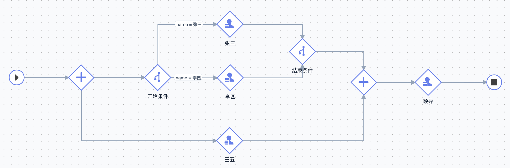

# 工作流事件处理说明

> 文档说明：本文档基于实际业务流程图，详细介绍工作流中与驳回/通过/跳过/回退/分支清理相关的三个核心事件处理器的作用、注册时机和执行逻辑。

*(示意图：包含并行网关、条件网关嵌套及 Proxy 节点的复杂流程)*

---

## 核心事件与节点对应关系

基于上图流程，各节点注册的事件如下：

| 节点名称 | 注册事件 | 作用简述 |
|---------|---------|---------|
| **张三 / 李四** | `EventConcurrentRejectCleanup` | 位于并行分支的条件网关内，驳回时清理同级任务。 |
| **张三 / 李四** | `EventInclusionPassCleanup` | 位于包容网关分支，通过时将同级任务置为 SystemPass。 |
| **王五** | `EventUserNodeRejectProxyCleanup` | 位于并行分支，且兄弟分支包含 Proxy 节点。 |
| **领导** | `EventGatewayConditionReject` | 位于汇聚网关之后，驳回时需处理上游的 Proxy 穿透。 |

---

## 一、EventConcurrentRejectCleanup （并发清理）

### 1.1 作用
当并行/包容网关由于嵌套了条件网关（如上图中的 Start Condition），导致分支内有多个层级时。位于内部的节点（张三/李四）被驳回，需要清理该分支内的兄弟任务状态。

### 1.2 注册场景
- **结构**：Parallel Gateway -> Condition Gateway -> **Me**
- **图中节点**：**张三**、**李四**

### 1.3 执行逻辑
当 **张三** 驳回时：
1. 检查自身状态为驳回。
2. 触发清理逻辑，将该条件网关分支下的其他待办任务（如可能存在的其他并发任务）标记为 `SystemReject`。

---

## 二、EventUserNodeRejectProxyCleanup （Proxy 环境标记/清理）

### 2.1 作用
处理 "兄弟分支有 Proxy" 的场景。当一个普通节点（王五）与一个生成了 Proxy 节点的复杂分支（张三/李四分支）并存时，如果王五驳回，需要感知到 Proxy 节点的存在并进行处理（清理/标记），防止死循环。

### 2.2 注册场景
- **结构**：Parallel Gateway -> **Me** (且 Parallel Gateway 的其他分支包含 Condition Gateway，从而生成了 Proxy)。
- **图中节点**：**王五**

### 2.3 执行逻辑
当 **王五** 驳回时：
1. 系统检测到当前所处的网关环境中，兄弟分支存在系统自动生成的 Proxy 节点。
2. 执行清理逻辑或标记日志（视具体实现版本），确保兄弟分支的 Proxy 节点任务被移除，防止工作流引擎错误地认为 Proxy 分支已完成而强行推进流程。

---

## 三、EventGatewayConditionReject （网关条件驳回/穿透）

### 3.1 作用
这是最复杂的处理器，主要负责解决 **"Proxy 穿透"** 和 **"汇聚点回退"** 的问题。它处理汇聚网关之后的节点驳回。

### 3.2 注册场景
- **结构**：Condition Gateway -> Parallel Gateway (Join) -> **Me**
- **图中节点**：**领导**

### 3.3 执行逻辑
当 **领导** 驳回时，面临两种情况：

#### **情况 A：回退路径遇到 Proxy 节点（穿透）**
假设流程虽然经过了汇聚网关，但上游分支中包含 Proxy 节点（例如张三通过了，生成了 Proxy）。
1. **识别**：领导驳回的前置节点指向了 Proxy 节点。
2. **反查**：事件反查数据库，找到该 Proxy 节点指向的**真实来源**（例如 **张三**）。
3. **穿透**：将领导任务的 `prev_node_id` 篡改为 **张三** 的 ID。
4. **结果**：工作流引擎将驳回路径修正为 `领导 -> 张三`，跳过 Proxy 和网关。

#### **情况 B：清理残留 Proxy**
1. 在修正回退路径的同时，物理删除数据库中已生成的 Proxy 节点任务记录。
2. **目的**：防止 Proxy 节点的状态（已完成）干扰后续流程重新流转，彻底消除脏数据。

---

## 四、EventInclusionPassCleanup （包容网关通过清理）

### 4.1 作用
实现包容网关（Inclusion Gateway）的 **"一票通过"** 或 **"竞争模式"**。当包容网关的某一分支率先通过（Pass）时，系统自动清理同一网关下的其他并行分支任务。

### 4.2 注册场景
- **结构**：Inclusion Gateway -> Condition Gateway -> **Me**
- **场景**：主要用于需要竞争处理的审批流程。

### 4.3 执行逻辑
当 **分支节点** 通过时：
1. 检查自身状态为通过（Status=1）。
2. 将同级（PrevNodeID相同）的其他兄弟分支任务状态统一修改为 **SystemPass (3)**。
3. **注意**：设置为 SystemPass 是为了让这些分支在可视化流程图中被识别为“被系统自动跳过/完成”，而不是驳回。

---

---

## 五、生命周期与标准流转事件

除了上述复杂的网关/驳回处理事件外，工作流引擎还包含以下核心生命周期事件：

### 5.1 EventStart (流程启动)
- **触发时机**：流程实例创建开始时。
- **作用**：初始化流程关联信息（如工单绑定），发送流程开始通知。

### 5.2 EventEnd (节点/流程结束)
- **触发时机**：节点执行结束或流程整体结束时。
- **作用**：记录节点结束日志，若是结束节点则修改工单状态为“已完成”。

### 5.3 EventNotify (节点通知/驱动)
- **触发时机**：节点被激活（到达）时。
- **作用**：
  1. 发送消息通知（给审批人）。
  2. **关键**：检测是否为系统代理节点（Proxy），若是则触发 `autoPassProxyNode` 自动流转。

### 5.4 EventAutomation (自动化执行)
- **触发时机**：到达自动化节点时。
- **作用**：异步调用 Task Service 创建并执行自动化任务，等待执行结果。

### 5.5 EventRevoke (流程撤销)
- **触发时机**：发起人主动撤销流程时。
- **作用**：记录撤销日志，清理流程实例状态。

### 5.6 EventTaskParallelNodePass / EventTaskInclusionNodePass (网关常规流转)
- **触发时机**：并行/包容网关下的任务节点提交**通过**时。
- **作用**：
  - 检查网关下的任务完成情况（如会签进度）。
  - 检查是否存在驳回状态（同步兄弟分支的状态）。
  - 决定是否推进到下一节点。

---

## 六、总结：驳回流转全景

| 动作 | 触发事件 | 结果 |
|------|---------|------|
| **张三 驳回** | `EventConcurrentRejectCleanup` | 自身分支结束，清理同分支兄弟（标记为 SystemReject）。 |
| **张三 通过** | `EventInclusionPassCleanup` | 自身通过，同分支兄弟标记为 SystemPass (系统自动通过/跳过)。 |
| **王五 驳回** | `EventUserNodeRejectProxyCleanup` | 自身驳回，同时清理兄弟分支（张三/李四那边）产生的 Proxy 节点。 |
| **领导 驳回** | `EventGatewayConditionReject` | 1. 穿透 Proxy，直接找 **张三/王五**。 2. 删除历史 Proxy 记录。 3. 流程回退到具体处理人。 |

> **核心原则**：所有涉及 Proxy 节点的驳回，必须 **"穿透虚拟节点，回归真实业务节点"**，并 **"物理删除 Proxy 记录"** 以防状态污染。
